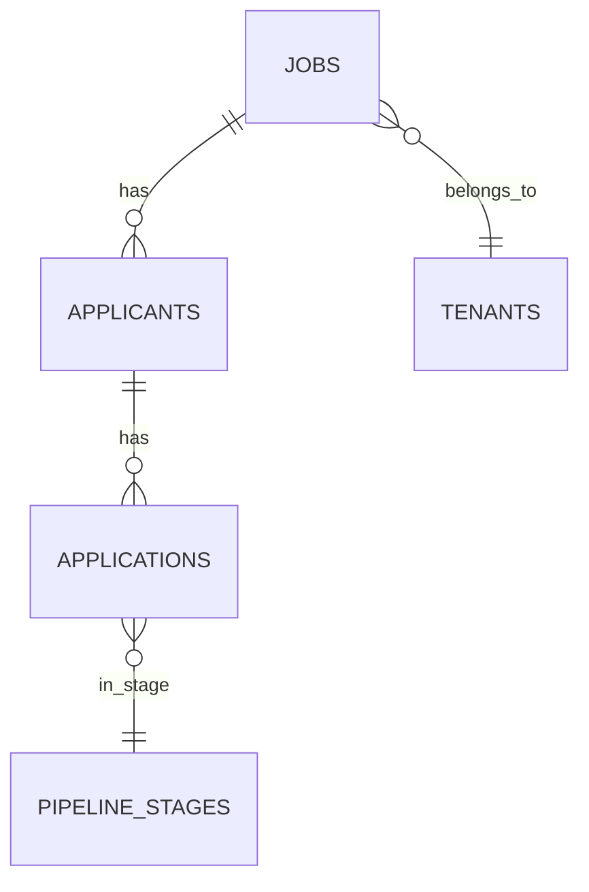

# Architecture > Data Model Page Template

The core entities and their relationships. For DB-backed products, essential. For products without persistent data (a sync script, a stateless service), skip this page.

## Properties

- **Name**: `Data Model`
- **Owner**: User
- **Verification**: Empty (draft)
- **Tags**: `Technical`, `Reference`

## Icon and cover

- **Icon**: 🗂️
- **Cover**: data / structural-themed gallery image

## Body structure

### 1. Definition callout

```
ℹ️ The core entities in {product}'s database, what they represent, and how they relate. Source of truth is the schema in {migrations path}.
```

### 2. Entity-relationship diagram (Mermaid)

A Mermaid ER diagram showing main entities and their relationships:



If there are 15+ tables, show only the core entities here and link to a sub-page for the full schema.

### 3. Entity descriptions

For each major entity, a small section with:
- **Name** (heading)
- **Purpose**: one sentence on what it represents
- **Key columns**: bulleted list of the columns that matter for understanding the model (not every column — link to the schema for that)
- **Relationships**: bullet on what it connects to

Example:
```
### applicants

**Purpose**: A person who applied to a job. One per job-application; if the same person applies to two jobs they have two applicant records.

**Key columns**:
- `id` (uuid, PK)
- `job_id` (uuid, FK to jobs)
- `current_stage` (enum, references pipeline_stages.code)
- `score` (int, 0-100, populated by scoring trigger)
- `parsed_cv` (jsonb, output of Anthropic CV parser)

**Relationships**: belongs to a job, has many applications (the historical state changes), references pipeline_stages.
```

### 4. Multi-tenancy notes (if applicable)

If the product is multi-tenant, a short callout explaining how tenant isolation works:

```
⚠️ Multi-tenancy is enforced via RLS policies on tables that have a `tenant_id` column. The `applicants` table deliberately does NOT have `tenant_id` because applicants are scoped through jobs (jobs have tenant_id, applicants belong to jobs). Adding direct queries on applicants without a join through jobs will bypass tenant isolation.
```

### 5. Schema source

Link to the actual migration files or schema definition in the repo. Always have a link — the wiki page is a summary, the code is the source of truth.

## What NOT to include

- Every column of every table (link to schema instead)
- Indexes (mostly implementation detail)
- Trigger logic (link to migration files)
- Historical schema (use a sub-page if needed)

## Source notes

- Schema entirely code-verified
- Entity purposes user-stated (the code can't tell you what `applicants` *means* in the domain)
- Relationships verifiable from FK constraints
- Multi-tenancy approach user-stated, verifiable from RLS policies
