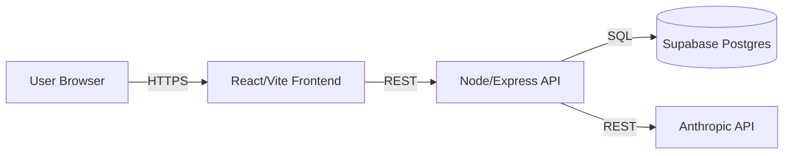

# Architecture > System Overview Page Template

High-level shape of the system. The page that lets a new contributor build a mental model in 60 seconds.

## Properties

- **Name**: `System Overview`
- **Owner**: User
- **Verification**: Empty (draft)
- **Tags**: `Technical`, `Reference`

## Icon and cover

- **Icon**: 🌐
- **Cover**: architectural / structural-themed gallery image

## Body structure

### 1. Opening paragraph

Plain prose, 1-2 sentences: the shape of the system at a high level.

### 2. Table of contents block

Insert a `/table_of_contents` block. Skip only if the page is very short (under 4 sections).

### 3. Diagram (single Mermaid block)

A Mermaid diagram showing the main components. Prefer a simple flowchart. Keep it under 10 nodes — if the system has more than 10 major components, this page is the wrong place to show them all (use sub-pages or layered diagrams).

**CRITICAL**: produce exactly ONE Notion code block with `language: mermaid`. Do NOT also include a separate code block, image, or rendered embed of the same diagram — that creates visible duplication on the page. The single mermaid code block renders the diagram natively.

**No `\n` literals** — use real newlines or ` ` for line breaks inside node labels. Better: keep node labels short enough to avoid line breaks entirely.

Example (correct format — single block, real labels):

### 4. Components

If there are 4 or fewer components, use a small `/table` block with two columns: Component | Responsibility.

If there are 5 or more components, use an **inline database** with columns:
- Component (title)
- File / path (text or URL to repo)
- Responsibility (text)
- Type (select: e.g. orchestrator, helper, config, entry-point)

This lets the reader sort and filter, which becomes valuable as the component count grows.

### 5. Key data flows (short bulleted list)

The 2-4 most important flows of data through the system, in plain English:

- User uploads a CV → API extracts text via Anthropic → result stored in `applicants.parsed_cv` JSONB column
- Job published in Zoho → Playwright script syncs to Indeed → status updated back in Supabase

Each flow should map to a workflow page — link with page mentions where applicable.

### 6. What's written vs not written (if applicable)

For products that touch shared resources (sheets, tables, external systems), a clear table of "what this system writes" vs "what it doesn't touch" is one of the most useful things on the page. Use a `/table` block with columns: Resource | Written by this | Notes.

### 7. Architectural conventions (short section, only if there are any worth noting)

Things a new contributor should know that aren't obvious from the code:
- Naming conventions
- Where to put new code (services vs lib vs utils)
- How errors propagate
- Where logging goes

If there are no notable conventions, skip this section.

## What NOT to include

- Detailed data model (lives on Data Model page)
- Detailed workflow steps (live on Workflow pages)
- Integration specifics (live on per-Integration pages)
- Code examples beyond minimal ones to illustrate a point
- Full deployment topology (lives on Deployment page)

## Source notes

- Diagram requires user input on the high-level shape; scaffold from detected components
- Component descriptions partly verifiable (paths, frameworks), partly user-stated (purpose, conventions)
- Data flows are user-stated — verifiable in code but only when you know what to look for
